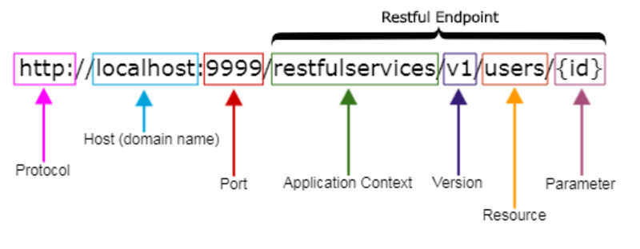

# API Routes

## chatBot
- ### [/chats](./chatBot/chats.js)
    - GET - /api/chats/:sessionId - message, created_at, sender_id - account restricted **TODO**
    - POST - /api/chats - account restricted **TODO**
    - DELETE - /api/chats/:id - owner restricted **TODO**

- ### [/memorys](./chatBot/memorys.js)
    - GET - /api/memorys/:userId - notes, created_at - owner restricted **TODO**
    - POST - /api/memorys - account restricted **TODO**
    - PUT - /api/memorys/:id - owner restricted **TODO**
    - DELETE - /api/memorys/:id - owner restricted **TODO**

- ### [/sessions](./chatBot/sessions.js)
    - GET - /api/sessions/:userId - dailyLimit, refreshLimit, created_at, expires_at - owner restricted **TODO**
    - POST - /api/sessions - account restricted **TODO**
    - PUT - /api/sessions/:id - owner restricted **TODO**
    - DELETE - /api/sessions/:id - owner restricted **TODO**

## map
- ### [/locations](./map/locations.js)
    - GET - /api/locations/:id - latitude, longitude, address - account restricted **TODO**
    - GET - /api/locations/poi/:poiId - latitude, longitude, address - account restricted **TODO**
    - POST - /api/locations - account restricted **TODO**
    - PUT - /api/locations/:id - account restricted **TODO**
    - DELETE - /api/locations/:id - owner restricted **TODO**

- ### [/poiContacts](./map/poiContacts.js)
    - GET - /api/poiContacts/:poiId - contact_poi_id, created_at - account restricted **TODO**
    - POST - /api/poiContacts - account restricted **TODO**
    - DELETE - /api/poiContacts/:poiId/:contactPoiId - account restricted **TODO**

- ### [/pointOfInterests](./map/pointOfInterests.js)
    - GET - /api/pointOfInterests/:id - name, description, type_id, created_at - account restricted **TODO**
    - GET - /api/pointOfInterests/trip/:tripId - name, description, type_id, created_at - account restricted **TODO**
    - POST - /api/pointOfInterests - account restricted **TODO**
    - PUT - /api/pointOfInterests/:id - owner restricted **TODO**
    - DELETE - /api/pointOfInterests/:id - owner restricted **TODO**

- ### [/trips](./map/trips.js)
    - GET - /api/trips/:id - title, description, start_date, end_date, location, created_at, updated_at - account restricted **TODO**
    - GET - /api/trips/user/:userId - title, description, start_date, end_date, location, created_at, updated_at - owner restricted **TODO**
    - POST - /api/trips - account restricted **TODO**
    - PUT - /api/trips/:id - owner restricted **TODO**
    - DELETE - /api/trips/:id - owner restricted **TODO**

- ### [/types](./map/types.js)
    - GET - /api/types - name, description - unrestricted **TODO**
    - GET - /api/types/:id - name, description - unrestricted **TODO**
    - POST - /api/types - account restricted **TODO**
    - PUT - /api/types/:id - account restricted **TODO**
    - DELETE - /api/types/:id - account restricted **TODO**

## social
- ### [/comments](./social/comments.js)
    - GET - /api/comments/post/:postId - content, user_id, created_at - account restricted **TODO**
    - GET - /api/comments/poi/:poiId - content, user_id, created_at - account restricted **TODO**
    - POST - /api/comments - account restricted **TODO**
    - PUT - /api/comments/:id - owner restricted **TODO**
    - DELETE - /api/comments/:id - owner restricted **TODO**

- ### [/images](./social/images.js)
    - GET - /api/images/post/:postId - url, created_at - account restricted **TODO**
    - GET - /api/images/user/:userId - url, created_at - account restricted **TODO**
    - GET - /api/images/poi/:poiId - url, created_at - account restricted **TODO**
    - POST - /api/images - account restricted **TODO**
    - DELETE - /api/images/:id - owner restricted **TODO**

- ### [/likes](./social/likes.js)
    - GET - /api/likes/post/:postId - user_id, created_at - account restricted **TODO**
    - GET - /api/likes/comment/:commentId - user_id, created_at - account restricted **TODO**
    - GET - /api/likes/poi/:poiId - user_id, created_at - account restricted **TODO**
    - POST - /api/likes - account restricted **TODO**
    - DELETE - /api/likes/:id - owner restricted **TODO**

## user
- ### [/posts](./user/posts.js)
    - GET - /api/posts/:id - title, content, trip_id, location_id, created_at, updated_at - account restricted **TODO**
    - GET - /api/posts/user/:userId - title, content, trip_id, location_id, created_at, updated_at - account restricted **TODO**
    - GET - /api/posts/trip/:tripId - title, content, location_id, created_at, updated_at - account restricted **TODO**
    - POST - /api/posts - account restricted **TODO**
    - PUT - /api/posts/:id - owner restricted **TODO**
    - DELETE - /api/posts/:id - owner restricted **TODO**

- ### [/users](./user/users.js)
    - POST - /api/users/register - unrestricted
    - POST - /api/users/login - unrestricted
    - GET - /api/users/:id - name, active, created_at, updated_at - account restricted **WIP**
    - GET - /api/users/:id/all - * - owner restricted **TODO**
    - PUT - /api/users/:id - owner restricted **TODO**
    - DELETE - /api/users/:id - owner restricted **TODO**

---

# Route Specifications
Above each route in the JS files there is a comment with the route's specifications

**GET - &lt;Resource&gt; - &lt;Data&gt; - &lt;Access&gt;**
`GET - api/users/:id - * - restricted`

**POST - &lt;Resource&gt; - &lt;Access&gt;**
`POST - api/users/register - unrestricted`

**Resource** is the path to the resource

**Data** specifies the data that the route is leting access to from the model
- `*` > All
- `email, name, etc` > Specific

**Access** is the level of a access someone needs to have to get to the resource
- `unrestricted` > Everyone has access
- `owner restricted` > Only the owner of the resource has access
- `account restricted` > Only logged in users have access

