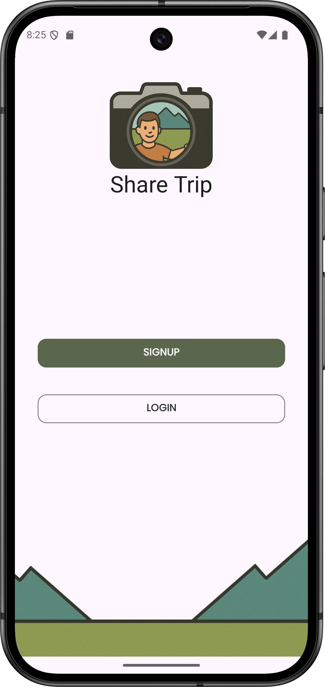
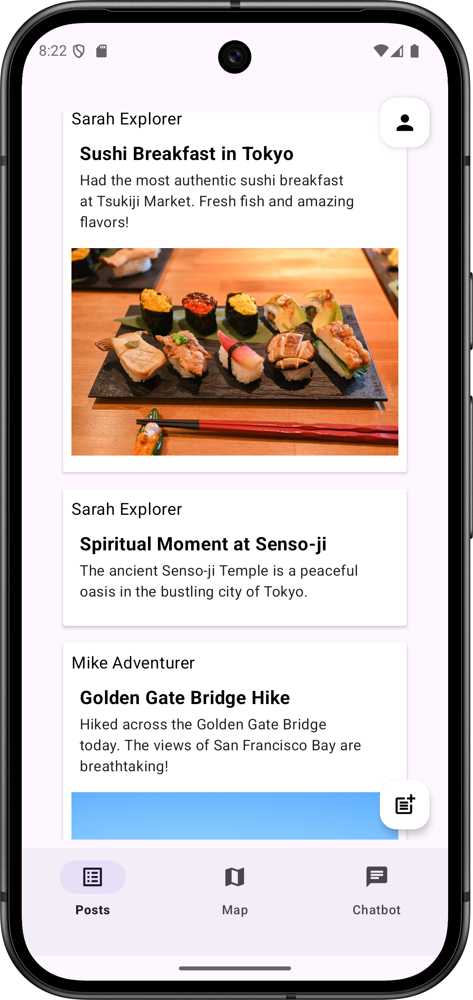
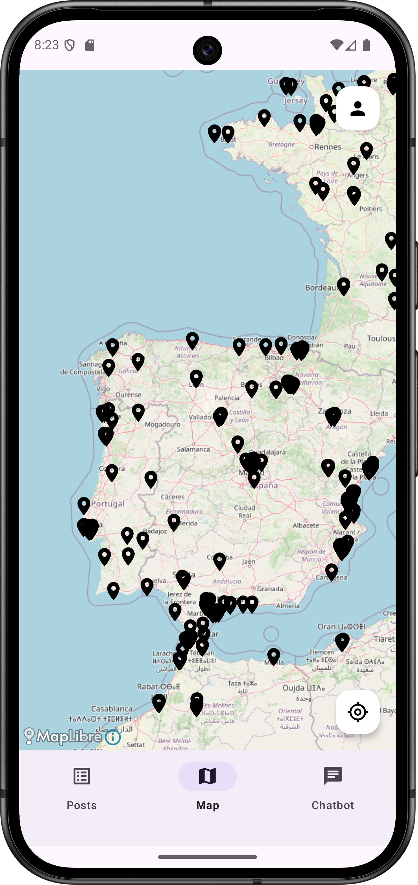
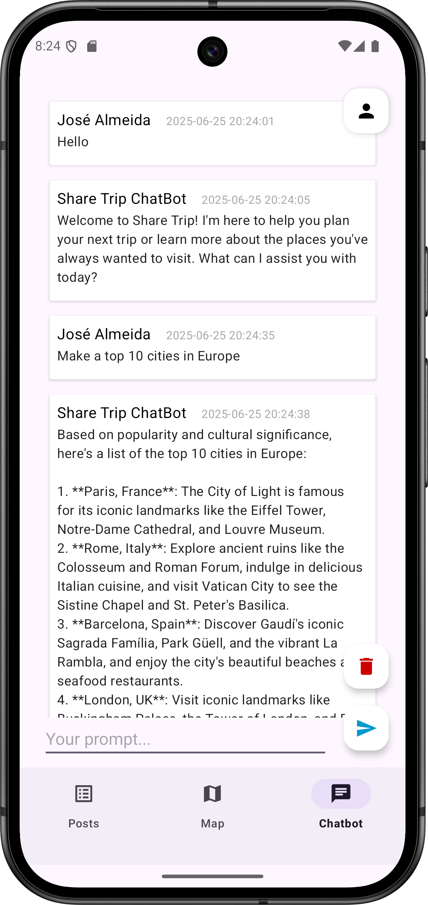
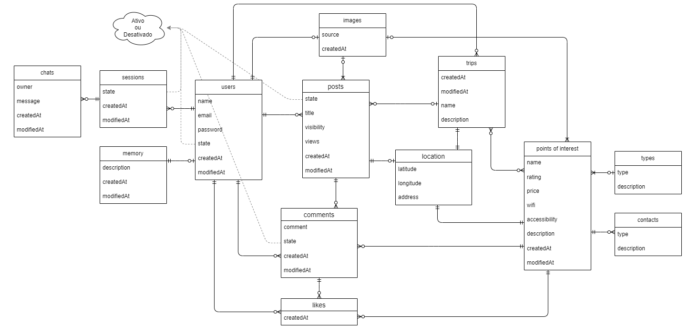

# Share Trip

Uma aplicação de viagens completa, concebida para ajudar viajantes de todo o mundo a descobrir, partilhar e conectar-se através das suas experiências de viagem. A app combina funcionalidades sociais com assistência baseada em IA para criar um verdadeiro companheiro de viagem.

## Logo


## 🚀 Funcionalidades

* **Rede Social de Viagens**: Partilha publicações
* **Pontos de Interesse (POI)**: Descobre informações baseadas na localização
* **ChatBot com IA**: Obtém assistência de viagem com o modelo Llama3.2:1b
* **Serviços de Localização**: Integração com GPS para funcionalidades baseadas na localização

## Capturas de ecrâ





## 📁 Estrutura do Projeto

```
├── API/                    # Servidor backend em Node.js
│   ├── app.js             # Ficheiro principal do servidor
│   ├── datasetLoader.js   # Script de população da base de dados
│   ├── api/               # Rotas e controladores da API
│   ├── config/            # Ficheiros de configuração
│   ├── models/            # Modelos de dados
│   └── services/          # Serviços com lógica de negócio
├── APP/                   # Aplicação Android
│   └── app/src/main/java/com/example/sharetrip/
├── DB/                    # Scripts da base de dados e datasets
│   ├── share-trip_v2.sql           # Estrutura principal da base de dados
│   ├── share-trip_v2-INSERT.sql    # Dados iniciais
│   └── pointsOfInterestDataSet.csv # Dataset dos Pontos de Interesse
└── IMG/                   # Imagens e recursos do projeto
```

## Base de Dados


## 🛠️ Especificações Técnicas

### Aplicação Android
- **SDK Mínimo**: API 24 (Android 7.0)
- **SDK Alvo**: API 35 (Android 15)
- **SDK de Compilação**: API 35
- **Versão do Gradle**: 8.10.2
- **Plugin Android Gradle**: 8.8.0
- **Versão Java**: 11

### API Backend
- **Node.js**: Versão recomendada 14+
- **MySQL**: Compatível com versões 5.7+

## 📚 Bibliotecas Utilizadas

### Aplicação Android

#### Bibliotecas de Interface e UI
- **[Material Design Components](https://github.com/material-components/material-components-android)** `1.12.0`
  - Componentes de interface seguindo Material Design

- **[ConstraintLayout](https://developer.android.com/jetpack/androidx/releases/constraintlayout)** `2.2.1`
  - Sistema de layout flexível para Android

#### Comunicação de Rede
- **[Retrofit](https://square.github.io/retrofit/)** `2.9.0`
  - Cliente HTTP type-safe para Android e Java

- **[Gson Converter](https://github.com/square/retrofit/tree/master/retrofit-converters/gson)** `2.9.0`
  - Conversor JSON para Retrofit usando Gson

#### Carregamento de Imagens
- **[Glide](https://bumptech.github.io/glide/)** `4.16.0`
  - Biblioteca de carregamento e cache de imagens

#### Mapas e Localização
- **[MapLibre Android SDK](https://github.com/maplibre/maplibre-native)** `11.5.1`
  - SDK de mapas open-source

- **[MapLibre Plugin Annotation](https://github.com/maplibre/maplibre-plugins-android)** `3.0.2`
  - Plugin para anotações em mapas

### API Backend

#### Dependências Node.js
- **[Express](https://expressjs.com/)** `5.1.0`
  - Framework web para Node.js

- **[MySQL2](https://github.com/sidorares/node-mysql2)** `3.14.1`
  - Cliente MySQL para Node.js

- **[bcryptjs](https://github.com/dcodeIO/bcrypt.js)** `3.0.2`
  - Biblioteca para hash de passwords

- **[jsonwebtoken](https://github.com/auth0/node-jsonwebtoken)** `9.0.2`
  - Implementação de JSON Web Tokens

- **[dotenv](https://github.com/motdotla/dotenv)** `16.5.0`
  - Carregamento de variáveis de ambiente

- **[morgan](https://github.com/expressjs/morgan)** `1.10.0`
  - Middleware de logging HTTP

- **[csv-parser](https://github.com/mafintosh/csv-parser)** `3.0.0`
  - Parser de ficheiros CSV

## 🛠️ Pré-requisitos

* **Node.js** (v14 ou superior)
* Servidor de base de dados **MySQL** (recomenda-se [XAMPP](https://www.apachefriends.org/) para desenvolvimento)
* **Android Studio** (versão mais recente)
* **Ollama** (para funcionalidade de ChatBot)

## ⚙️ Instruções de Configuração

### 1. Configurar a Base de Dados

1. Instala e inicia um servidor MySQL (recomenda-se [XAMPP](https://www.apachefriends.org/))
2. Cria a base de dados executando o script [`share-trip_v2.sql`](DB/share-trip_v2.sql)
3. Insere os dados iniciais com o script [`share-trip_v2-INSERT.sql`](DB/share-trip_v2-INSERT.sql)

### 2. Configurar o Servidor da API

1. Acede ao diretório da API:

   ```bash
   cd API
   ```

2. Instala as dependências:

   ```bash
   npm install
   ```

3. Configura as variáveis de ambiente:

   * Copia o ficheiro [`.env.template`](API/config/.env.template) para `.env` dentro do diretório `API/config/`
   * Atualiza os valores no ficheiro `.env`:

   ```bash
   DEV_MODE=TRUE
   DB_HOST=localhost
   DB_PORT=3306
   DB_USERNAME=root
   DB_PASSWORD=a_sua_password_mysql
   DB=sharetrip
   BCRYPT_SALT=10
   API_PORT=8800
   SECRET_KEY=chave_secreta_aqui
   ```

4. Carrega o dataset de POIs:

   ```bash
   node datasetLoader.js
   ```

   Aguarda até o processo terminar (isto vai popular a base de dados com os dados dos Pontos de Interesse a partir de [`pointsOfInterestDataSet.csv`](DB/pointsOfInterestDataSet.csv)).

### 3. Configurar o ChatBot com IA

1. Instala o [Ollama](https://ollama.com/download/)
2. Faz o download e corre o modelo de IA:

   ```bash
   ollama run llama3.2:1b
   ```

   Isto fará o download do modelo se ainda não estiver instalado.

### 4. Iniciar o Servidor da API

Inicia o servidor com um dos seguintes comandos:

```bash
# Execução normal
node app.js

# Modo de desenvolvimento (caso tenhas o nodemon instalado)
nodemon app.js
```

A API estará disponível em `http://localhost:8800` (ou na porta que tiveres configurado).

### 5. Configurar a App Android

1. Abre a pasta `APP` no Android Studio
2. Atualiza o endereço IP do servidor no ficheiro [`ApiClient.java`](APP/app/src/main/java/com/example/sharetrip/api/ApiClient.java)
3. Compila e executa a aplicação no teu dispositivo ou emulador

## 📂 Processo de Importação do Projeto

### Importação da Aplicação Android

1. **Abrir o Android Studio**
2. **Selecionar "Open"** e navegar até à pasta `APP` do projeto
3. **Aguardar a sincronização** - O Gradle irá automaticamente descarregar todas as dependências definidas em [`build.gradle.kts`](APP/app/build.gradle.kts)
4. **Configurar o SDK** se necessário:
   - Ir a File → Project Structure → Modules → App
   - Verificar se o Compile SDK está definido para API 35
   - Verificar se o Build Tools Version está atualizado
5. **Sync Project with Gradle Files** se solicitado
6. **Configurar o IP do servidor** no ficheiro [`ApiClient.java`](APP/app/src/main/java/com/example/sharetrip/api/ApiClient.java)

### Importação da API Backend

1. **Navegar para a pasta API**:
   ```bash
   cd API
   ```
2. **Instalar dependências**:
   ```bash
   npm install
   ```
3. **Executar o projeto**:
   ```bash
   node app.js
   ```

### Configuração Adicional da Base de Dados

1. **Importar estrutura da base de dados**:
   - Executar [`share-trip_v2.sql`](DB/share-trip_v2.sql) no MySQL
2. **Importar dados iniciais**:
   - Executar [`share-trip_v2-INSERT.sql`](DB/share-trip_v2-INSERT.sql)
3. **Popular dados dos POIs**:
   - Executar `node datasetLoader.js` na pasta API

## 📱 Endpoints da API

A API fornece os seguintes grupos principais de endpoints:

* **🤖 ChatBot**: Chat com inteligência artificial
* **🗺️ Mapa**: Localizações e pontos de interesse
* **👥 Social**: Publicações
* **👤 Utilizador**: Autenticação e gestão de utilizadores

Para documentação detalhada da API, vê [`API/api/routes.md`](API/api/routes.md).

## 🧪 Testes

Atualmente, não existem testes automatizados configurados. Para testar:

1. Garante que todos os serviços estão a funcionar (Base de Dados, API, Ollama)
2. Usa a app Android para testar funcionalidades
3. Usa ferramentas como o Postman para testar endpoints da API

## 🤝 Contribuição

Este projeto foi desenvolvido por André Silva e Samuel Santos como parte de um projeto académico.

## 🆘 Resolução de Problemas

* **Erros na ligação à base de dados**: Verifica se o MySQL está a correr e se as credenciais no ficheiro `.env` estão corretas
* **API sem resposta**: Confirma se o servidor arrancou com sucesso e se a porta está disponível (por defeito: 8800)
* **ChatBot sem funcionar**: Verifica se o Ollama está instalado e se o modelo foi corretamente descarregado
* **Problemas de ligação da app Android**: Confirma o IP do servidor no ficheiro [`ApiClient.java`](APP/app/src/main/java/com/example/sharetrip/api/ApiClient.java)
* **Erro ao carregar os POIs**: Garante que a base de dados está corretamente configurada antes de correres o [`datasetLoader.js`](API/datasetLoader.js)
* **Problemas de sincronização do Gradle**: Tenta "Clean Project" e "Rebuild Project" no Android Studio
* **Erros de dependências**: Verifica se tens a versão correta do Android Studio e do Java SDK

- ### Configuração do Ambiente

    - Certifica-te de que o teu ficheiro [`.env`](API/config/.env) está corretamente configurado com:

        * Credenciais corretas da base de dados
        * Chave secreta válida para autenticação JWT
        * Definições de porta apropriadas
